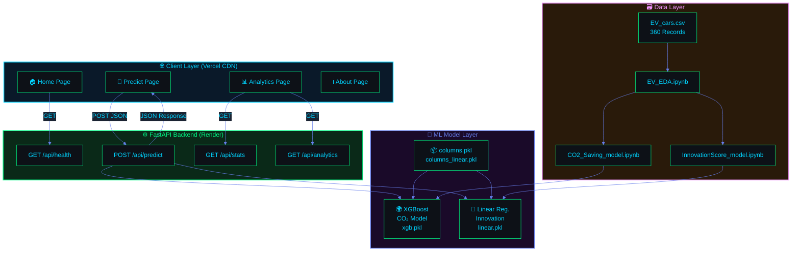
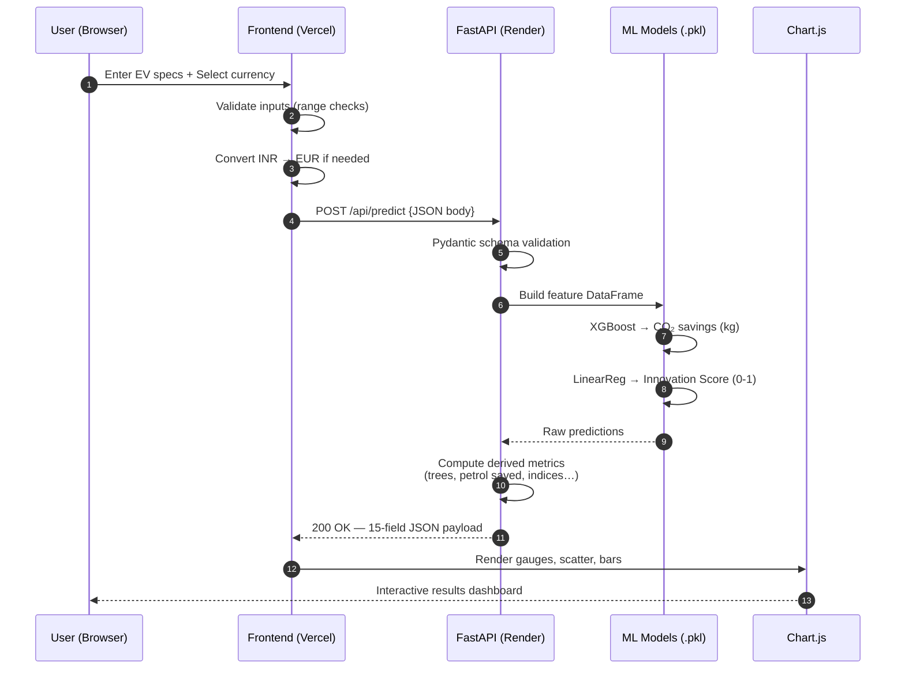
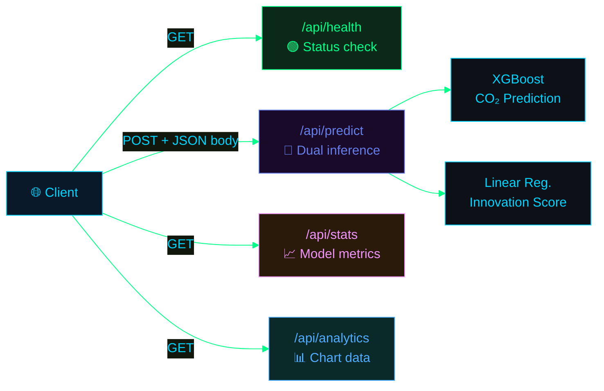
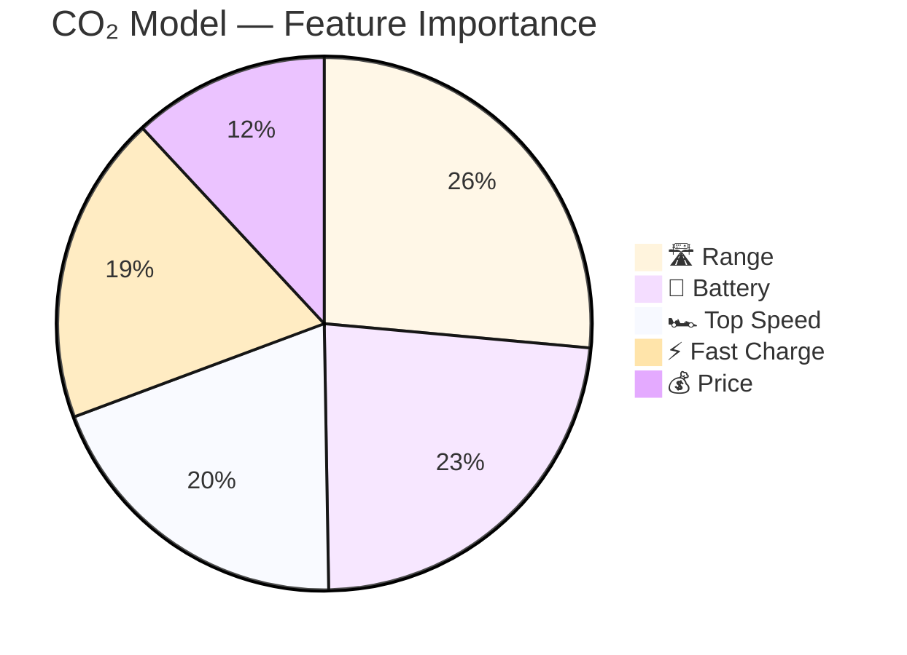
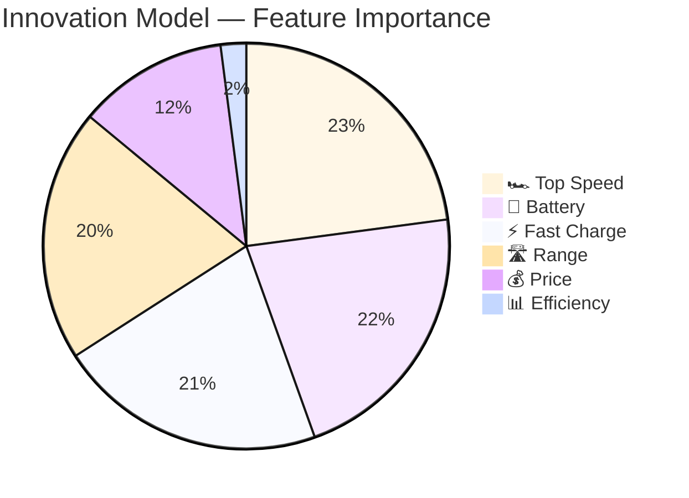
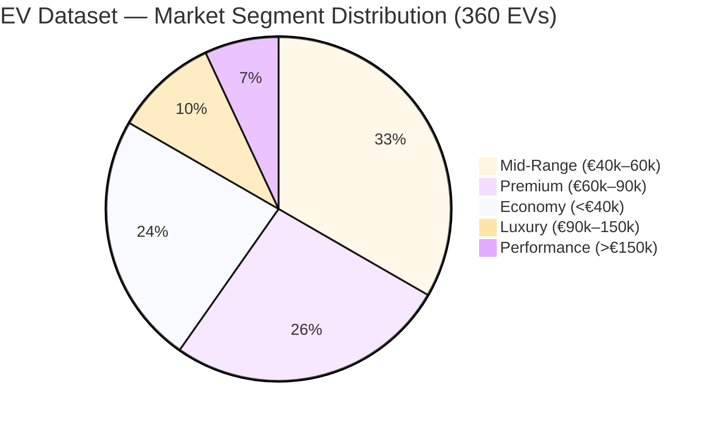
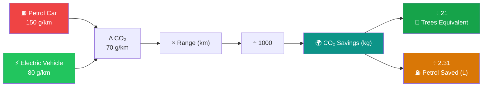
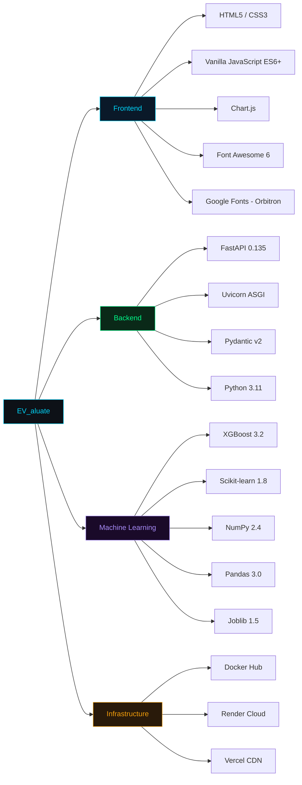

<div align="center">


<br/>

[](https://python.org)
[](https://fastapi.tiangolo.com)
[](https://xgboost.readthedocs.io)
[](https://scikit-learn.org)
[](https://hub.docker.com/repository/docker/ragas111/ev_aluate-backend/general)
[](LICENSE)

<br/>

[](https://ev-aluate-co2-saving-and-innovation.vercel.app/)
[](https://ev-aluate-co2-saving-and-innovation.onrender.com)
[](https://hub.docker.com/repository/docker/ragas111/ev_aluate-backend/general)

<br/>

```
╔══════════════════════════════════════════════════════════════════════════════╗
║  ███████╗██╗   ██╗     █████╗ ██╗     ██╗   ██╗ █████╗ ████████╗███████╗  ║
║  ██╔════╝██║   ██║    ██╔══██╗██║     ██║   ██║██╔══██╗╚══██╔══╝██╔════╝  ║
║  █████╗  ██║   ██║    ███████║██║     ██║   ██║███████║   ██║   █████╗    ║
║  ██╔══╝  ╚██╗ ██╔╝    ██╔══██║██║     ██║   ██║██╔══██║   ██║   ██╔══╝   ║
║  ███████╗ ╚████╔╝     ██║  ██║███████╗╚██████╔╝██║  ██║   ██║   ███████╗  ║
║  ╚══════╝  ╚═══╝      ╚═╝  ╚═╝╚══════╝ ╚═════╝ ╚═╝  ╚═╝   ╚═╝   ╚══════╝  ║
║                    🚗⚡  Intelligent EV Analysis Engine  ⚡🚗                 ║
╚══════════════════════════════════════════════════════════════════════════════╝
```

</div>

---

## 🗺️ Table of Contents

<div align="center">

| Section | Description |
|:-------:|:-----------|
| [🎬 Live Demo](#-live-demo--platform-preview) | Frontend, API & Docker links |
| [✨ Features](#-key-features) | What EV_aluate does |
| [🏗️ Architecture](#️-system-architecture) | Full-stack system design |
| [🔌 API Reference](#-api-reference--endpoints) | All endpoints documented |
| [🤖 ML Models](#-machine-learning-models) | XGBoost & Linear Regression deep-dive |
| [📊 Analytics & Metrics](#-analytics--performance-metrics) | Model performance, feature importance |
| [🗃️ Data Pipeline](#️-data-pipeline) | From raw CSV to production |
| [📁 Repo Structure](#-repository-structure) | Project layout |
| [🚀 Quick Start](#-quick-start) | Local, Docker, API |
| [🐳 Docker Deployment](#-docker-deployment) | Container setup |
| [🔮 Roadmap](#-roadmap) | Future plans |

</div>

---

## 🎬 Live Demo & Platform Preview

<div align="center">

```
 ┌─────────────────────────────────────────────────────────────────────┐
 │                  🌐  EV_aluate  v2.0  —  Live Stack                 │
 ├────────────────────┬────────────────────┬────────────────────────────┤
 │   🖥️  FRONTEND     │   ⚙️  BACKEND       │   🐳  DOCKER               │
 │                    │                    │                            │
 │  Vercel CDN        │  Render Cloud      │  Docker Hub                │
 │  Vanilla JS + CSS  │  FastAPI + Uvicorn │  python:3.11-slim          │
 │  Orbitron / Rajd.  │  Port 8000         │  ragas111/ev_aluate        │
 │                    │                    │  -backend:latest           │
 ├────────────────────┼────────────────────┼────────────────────────────┤
 │  ⚡ 4-page SPA     │  📡 4 REST APIs    │  🏗️ Multi-layer image      │
 │  📊 Chart.js viz   │  🤖 2 ML models    │  ⚙️ Uvicorn entrypoint     │
 │  💱 INR / EUR      │  🛡️ CORS enabled   │  📦 Self-contained         │
 └────────────────────┴────────────────────┴────────────────────────────┘
```

| Layer | URL | Status |
|:------|:----|:------:|
| 🌐 **Frontend (Vercel)** | [ev-aluate-co2-saving-and-innovation.vercel.app](https://ev-aluate-co2-saving-and-innovation.vercel.app/) |  |
| ⚙️ **Backend (Render)** | [ev-aluate-co2-saving-and-innovation.onrender.com](https://ev-aluate-co2-saving-and-innovation.onrender.com) |  |
| 📚 **Swagger UI** | [/docs](https://ev-aluate-co2-saving-and-innovation.onrender.com/docs) |  |
| 🐳 **Docker Hub** | [ragas111/ev_aluate-backend](https://hub.docker.com/repository/docker/ragas111/ev_aluate-backend/general) |  |

</div>

---

## ✨ Key Features

<table>
<tr>
<td width="33%" align="center">

### 🌍 CO₂ Savings Engine
Predict how much CO₂ your EV saves vs petrol vehicles — powered by XGBoost

```
R²  : 99.57%
MAE : 0.312 kg
RMSE: 0.472 kg
CV  : 99.38%
```

🌱 Tree equivalents  
⛽ Petrol saved (litres)  
📊 Percentage reduction

</td>
<td width="33%" align="center">

### 🚀 Innovation Score
Composite 0–1 score measuring technological advancement

```
R²  : 99.04%
MAE : 0.0066
RMSE: 0.0100
CV  : 99.24%
```

🔋 Tech Edge (40%)  
⚡ Energy Intelligence (40%)  
💎 User Value (20%)

</td>
<td width="33%" align="center">

### 💱 Global Currency
Full INR ⇌ EUR auto-conversion for Indian & European markets

```
1 EUR = ~90.9 INR
1 INR = 0.011 EUR
```

🇮🇳 Indian Rupees  
🇪🇺 Euros  
🔄 Real-time toggle

</td>
</tr>
<tr>
<td width="33%" align="center">

### 📡 REST API
Fully documented FastAPI backend with OpenAPI/Swagger

```
GET  /api/health
POST /api/predict
GET  /api/stats
GET  /api/analytics
```

🛡️ CORS enabled  
📦 JSON responses  
⚡ Uvicorn ASGI

</td>
<td width="33%" align="center">

### 📊 Interactive Analytics
Rich Chart.js-powered dashboard with 6+ chart types

```
Radar   • Training Curves
Scatter • Heatmaps
Gauge   • Pie/Donut
```

🎯 Model comparison  
📈 Convergence charts  
🗂️ EV segment analysis

</td>
<td width="33%" align="center">

### 🐳 Docker Ready
Production-hardened container image on Docker Hub

```bash
docker pull \
  ragas111/ev_aluate-backend
docker run -p 8000:8000 \
  ragas111/ev_aluate-backend
```

🐍 Python 3.11-slim  
📦 Optimised layers  
⚙️ Zero-config boot

</td>
</tr>
</table>

---

## 🏗️ System Architecture

<div align="center">



</div>

### 🔄 Request–Response Flow

<div align="center">



</div>

---

## 🔌 API Reference & Endpoints

> **Base URL:** `https://ev-aluate-co2-saving-and-innovation.onrender.com`  
> **Interactive Docs:** [`/docs`](https://ev-aluate-co2-saving-and-innovation.onrender.com/docs) (Swagger UI) | [`/redoc`](https://ev-aluate-co2-saving-and-innovation.onrender.com/redoc) (ReDoc)

---

### `GET /api/health`

<details>
<summary><b>🟢 Health Check — Verify backend & model status</b></summary>

**Description:** Returns the API health status and whether ML models are loaded in memory.

**Request:**
```http
GET /api/health HTTP/1.1
Host: ev-aluate-co2-saving-and-innovation.onrender.com
```

**Response `200 OK`:**
```json
{
  "status": "healthy",
  "models_loaded": true,
  "version": "2.0.0"
}
```

| Field | Type | Description |
|-------|------|-------------|
| `status` | `string` | Always `"healthy"` when API is reachable |
| `models_loaded` | `boolean` | `true` if both `.pkl` models are in memory |
| `version` | `string` | API semantic version |

**cURL:**
```bash
curl https://ev-aluate-co2-saving-and-innovation.onrender.com/api/health
```

</details>

---

### `POST /api/predict`

<details>
<summary><b>🔮 Dual Prediction — CO₂ Savings & Innovation Score</b></summary>

**Description:** Core inference endpoint. Accepts vehicle specifications and returns both CO₂ savings and Innovation Score predictions along with 13 derived insight metrics.

**Request Body (JSON):**

```json
{
  "battery":    75.0,
  "efficiency": 149.0,
  "fast_charge": 780.0,
  "price":      55220.0,
  "range_km":   505.0,
  "top_speed":  201.0,
  "currency":   "EUR"
}
```

**Input Schema:**

| Field | Type | Min | Max | Unit | Description |
|-------|------|:---:|:---:|:----:|-------------|
| `battery` | `float` | 20.0 | 130.0 | kWh | Battery pack capacity |
| `efficiency` | `float` | 130.0 | 300.0 | Wh/km | Energy consumption per km |
| `fast_charge` | `float` | 150.0 | 1300.0 | km/h | Fast charge rate |
| `price` | `float` | 1000.0 | — | EUR/INR | Vehicle price |
| `range_km` | `float` | 130.0 | 700.0 | km | Max range on full charge |
| `top_speed` | `float` | 120.0 | 330.0 | km/h | Maximum speed |
| `currency` | `string` | — | — | — | `"EUR"` or `"INR"` |

**Response `200 OK`:**

```json
{
  "co2_savings":        28.35,
  "innovation_score":   0.6412,
  "co2_percentage":     56.7,
  "inno_percentage":    64.12,
  "trees_equivalent":   1.35,
  "petrol_saved":       12.27,
  "tech_edge":          72.4,
  "energy_intel":       68.1,
  "user_value":         83.3,
  "battery_efficiency": 14.85,
  "charge_index":       10.4,
  "price_eur":          55220.0,
  "context_innovation": [0.638, 0.645, ...],
  "context_co2":        [27.1, 29.8, ...],
  "currency_used":      "EUR"
}
```

**Response Fields:**

| Field | Type | Description |
|-------|------|-------------|
| `co2_savings` | `float` | CO₂ saved vs petrol vehicle (kg/full-charge cycle) |
| `innovation_score` | `float` | Composite innovation index `[0 – 1]` |
| `co2_percentage` | `float` | CO₂ performance as % of 50 kg benchmark |
| `inno_percentage` | `float` | Innovation score as percentage `[0 – 100]` |
| `trees_equivalent` | `float` | CO₂ savings ÷ 21 kg (annual tree absorption) |
| `petrol_saved` | `float` | CO₂ savings ÷ 2.31 kg/litre petrol factor |
| `tech_edge` | `float` | Tech Edge sub-score `[0 – 100]` |
| `energy_intel` | `float` | Energy Intelligence sub-score `[0 – 100]` |
| `user_value` | `float` | User Value sub-score `[0 – 100]` |
| `battery_efficiency` | `float` | Battery / Range ratio × 100 |
| `charge_index` | `float` | Fast charge speed ÷ battery capacity |
| `price_eur` | `float` | Price normalised to EUR |
| `context_innovation` | `float[]` | 49 synthetic context samples for scatter plot |
| `context_co2` | `float[]` | 49 synthetic context samples for scatter plot |
| `currency_used` | `string` | Currency received in request |

**Error Responses:**

| Code | Reason |
|:----:|--------|
| `422` | Input validation failed (Pydantic schema mismatch) |
| `503` | Model `.pkl` files not found / not loaded |
| `500` | Internal prediction error |

**cURL Example:**
```bash
curl -X POST \
  https://ev-aluate-co2-saving-and-innovation.onrender.com/api/predict \
  -H "Content-Type: application/json" \
  -d '{
    "battery": 75, "efficiency": 149, "fast_charge": 780,
    "price": 55220, "range_km": 505, "top_speed": 201, "currency": "EUR"
  }'
```

**Python Example:**
```python
import httpx

payload = {
    "battery": 75.0, "efficiency": 149.0, "fast_charge": 780.0,
    "price": 55220.0, "range_km": 505.0, "top_speed": 201.0, "currency": "EUR"
}
r = httpx.post(
    "https://ev-aluate-co2-saving-and-innovation.onrender.com/api/predict",
    json=payload
)
print(r.json())
```

</details>

---

### `GET /api/stats`

<details>
<summary><b>📈 Model Statistics — Performance metrics & feature importance</b></summary>

**Description:** Returns pre-computed model performance metrics, dataset summary, feature importance rankings, and currency conversion rates.

**Response `200 OK`:**
```json
{
  "model_metrics": {
    "co2": {
      "r2": 0.9957, "mae": 0.312, "rmse": 0.472,
      "cv_mean": 0.9938, "cv_std": 0.0029,
      "model_type": "XGBoost Regressor",
      "accuracy_pct": 99.57
    },
    "innovation": {
      "r2": 0.9904, "mae": 0.0066, "rmse": 0.0100,
      "cv_mean": 0.9924, "cv_std": 0.0017,
      "model_type": "Linear Regression",
      "accuracy_pct": 99.04
    }
  },
  "dataset": {
    "total_evs": 360,
    "features_co2": 5,
    "features_innovation": 6,
    "train_split": 0.8,
    "cv_folds": 5
  },
  "feature_importance": {
    "features":         ["Range","Battery","Top Speed","Fast Charge","Price"],
    "co2_model":        [100, 88, 74, 71, 45],
    "innovation_model": [79, 85, 90, 84, 47]
  },
  "currency": {
    "eur_to_inr": 90.91,
    "inr_to_eur": 0.011
  }
}
```

**cURL:**
```bash
curl https://ev-aluate-co2-saving-and-innovation.onrender.com/api/stats
```

</details>

---

### `GET /api/analytics`

<details>
<summary><b>📊 Analytics Data — Training curves, correlations & EV segments</b></summary>

**Description:** Returns rich analytics data for dashboard visualisation: training convergence curves (100 iterations), feature-to-target correlation matrix, EV market segment breakdown, and radar chart data for model quality comparison.

**Response `200 OK` (abbreviated):**
```json
{
  "training_convergence": {
    "iterations":        [1, 2, ..., 100],
    "co2_scores":        [0.8500, 0.8571, ..., 0.9957],
    "innovation_scores": [0.8800, 0.8858, ..., 0.9904]
  },
  "correlation_matrix": {
    "features":         ["Battery","Fast Charge","Top Speed","Range","Efficiency","Price"],
    "co2_savings":       [1.00, 0.65, 0.70, 0.85, 0.15, 0.55],
    "range_factor":      [0.88, 0.71, 0.74, 1.00, 0.08, 0.45],
    "innovation_score":  [0.85, 0.84, 0.90, 0.79, 0.08, 0.47]
  },
  "ev_segments": {
    "labels":         ["Economy","Mid-Range","Premium","Luxury","Performance"],
    "co2_avg":        [18.5, 28.3, 35.6, 40.2, 32.1],
    "innovation_avg": [0.42, 0.58, 0.72, 0.68, 0.81],
    "count":          [85, 120, 95, 35, 25]
  },
  "model_radar": {
    "categories":         ["R² Score","CV Mean","Low MAE","Low RMSE","Consistency"],
    "co2_values":         [99.57, 99.38, 96.88, 95.28, 99.71],
    "innovation_values":  [99.04, 99.24, 93.40, 90.00, 99.83]
  }
}
```

**cURL:**
```bash
curl https://ev-aluate-co2-saving-and-innovation.onrender.com/api/analytics
```

</details>

---

### API Summary

<div align="center">



| Method | Endpoint | Auth | Description |
|:------:|:---------|:----:|:-----------|
| `GET` | `/api/health` | None | Server & model status |
| `POST` | `/api/predict` | None | Run CO₂ + Innovation inference |
| `GET` | `/api/stats` | None | Model metrics & feature importance |
| `GET` | `/api/analytics` | None | Training curves, correlations, segments |
| `GET` | `/docs` | None | Swagger UI (auto-generated) |
| `GET` | `/redoc` | None | ReDoc documentation |

</div>

---

## 🤖 Machine Learning Models

### 🌍 Model 1 — CO₂ Savings Predictor (XGBoost)

<div align="center">

```
╔═══════════════════════════════════════════════════════════════════════╗
║                  🌍  CO₂ SAVINGS PREDICTION MODEL                     ║
╠═══════════════════════════════════════════════════════════════════════╣
║  Algorithm : XGBoost Gradient Boosting Regressor  v3.2.0             ║
║  Artifact  : xgb.pkl + columns.pkl                                    ║
║  Training  : 288 samples (80%)  │  Test : 72 samples (20%)           ║
╠═══════════════════════════════════════════════════════════════════════╣
║                        HYPERPARAMETERS                                ║
╠══════════════════════════════════════════════════════════════════════╣
║  n_estimators     300     │  learning_rate    0.05                    ║
║  max_depth        4       │  subsample        0.8                     ║
║  colsample_bytree 0.8     │  min_child_weight 3                       ║
║  gamma            0.2     │  reg_alpha        0.1                     ║
║  reg_lambda       1.0     │  cv_folds         5                       ║
╚═══════════════════════════════════════════════════════════════════════╝
```

</div>

**Feature Importance:**



**Performance:**

| Metric | Value | Visual | Rating |
|--------|:-----:|--------|:------:|
| R² Score | `0.9957` | `████████████████████ 99.57%` | ⭐⭐⭐⭐⭐ |
| MAE | `0.312 kg` | `█ 3.1%` | ⭐⭐⭐⭐⭐ |
| RMSE | `0.472 kg` | `██ 4.7%` | ⭐⭐⭐⭐⭐ |
| CV Mean | `0.9938` | `████████████████████ 99.38%` | ⭐⭐⭐⭐⭐ |
| CV Std | `0.0029` | `▌ 0.29%` | ⭐⭐⭐⭐⭐ |

---

### 🚀 Model 2 — Innovation Score Engine (Linear Regression)

<div align="center">

```
╔═══════════════════════════════════════════════════════════════════════╗
║               🚀  INNOVATION SCORE PREDICTION MODEL                   ║
╠═══════════════════════════════════════════════════════════════════════╣
║  Algorithm : Ordinary Least Squares Linear Regression  (sklearn 1.8) ║
║  Artifact  : linear.pkl + columns_linear.pkl                          ║
║  Training  : 288 samples (80%)  │  Test : 72 samples (20%)           ║
╠═══════════════════════════════════════════════════════════════════════╣
║                        HYPERPARAMETERS                                ║
╠═══════════════════════════════════════════════════════════════════════╣
║  fit_intercept    True    │  copy_X           True                    ║
║  n_jobs           -1      │  positive         False                   ║
╚═══════════════════════════════════════════════════════════════════════╝
```

</div>

**Feature Importance:**



**Innovation Score Formula:**

<div align="center">

```
 Innovation Score  =  0.4 × Tech_Edge  +  0.4 × Energy_Intel  +  0.2 × User_Value
                                │                    │                    │
                  ┌─────────────┘          ┌─────────┘          ┌────────┘
                  ▼                        ▼                     ▼
      0.5 × norm(Fast_charge)   0.6 × norm(Efficiency)   0.5 × (1-norm(Price))
    + 0.5 × norm(Top_speed)   + 0.4 × norm(Range)      + 0.5 × (1-norm(Accel))

      norm() = Min-Max normalisation  →  [0, 1]
```

</div>

**Score Interpretation:**

| Range | Stars | Meaning | Example EVs |
|:-----:|:-----:|:--------|:-----------|
| 0.80 – 1.00 | ⭐⭐⭐⭐⭐ | Exceptional — cutting-edge | Tesla Model S Plaid, Lucid Air |
| 0.60 – 0.79 | ⭐⭐⭐⭐ | Excellent — advanced balance | Tesla Model 3, BMW iX |
| 0.40 – 0.59 | ⭐⭐⭐ | Good — solid value | VW ID.4, Hyundai Ioniq 5 |
| 0.20 – 0.39 | ⭐⭐ | Fair — budget-conscious | Dacia Spring, MG ZS EV |
| 0.00 – 0.19 | ⭐ | Entry — basic EV | Urban commuters |

---

## 📊 Analytics & Performance Metrics

### Model Training Convergence — R² Score vs Iterations

```
  Legend:  [C] = CO₂ Model (XGBoost)      [I] = Innovation Model (Linear Reg.)
  ─────────────────────────────────────────────────────────────────────────────

  R²
  1.000 ┤                                                          [C]
  0.998 ┤                                                     [C]
  0.996 ┤                                                [C]
  0.994 ┤                                     [C]   [I]──────────────[I]
  0.992 ┤                               [I]────────[C]
  0.990 ┤                          [I]                                   Final:
  0.988 ┤                    [C]────────────────────────────────  [C] = 0.9957 ✅
  0.986 ┤               [I]                                        [I] = 0.9904 ✅
  0.984 ┤          [C]
  0.982 ┤     [I]
  0.980 ┤[C]
  0.960 ┤
  0.940 ┤[I] (start)
  0.920 ┤[C] (start)
        └──────┬──────┬──────┬──────┬──────┬──────┬──────┬──────┬──────┬──────→
             Iter10  20    30    40    50    60    70    80    90   100

  Iteration Snapshots:
  ┌──────────┬────────┬────────┬────────┬────────┬────────┬────────┐
  │ Model    │ It. 10 │ It. 20 │ It. 30 │ It. 50 │ It. 75 │ It.100 │
  ├──────────┼────────┼────────┼────────┼────────┼────────┼────────┤
  │ CO₂ [C]  │ 0.9230 │ 0.9440 │ 0.9570 │ 0.9680 │ 0.9750 │ 0.9957 │
  │ Inno [I] │ 0.9120 │ 0.9340 │ 0.9480 │ 0.9610 │ 0.9690 │ 0.9904 │
  └──────────┴────────┴────────┴────────┴────────┴────────┴────────┘
```

### 5-Fold Cross-Validation Results

<div align="center">

**CO₂ Model (XGBoost)**

```
Fold 1 │ ████████████████████ R² = 0.9965
Fold 2 │ ████████████████████ R² = 0.9912
Fold 3 │ ████████████████████ R² = 0.9941
Fold 4 │ ████████████████████ R² = 0.9938
Fold 5 │ ████████████████████ R² = 0.9934
       └────────────────────────────────────
Mean   │ 0.9938 ± 0.0029   ← Near-perfect ✅
```

**Innovation Model (Linear Regression)**

```
Fold 1 │ ████████████████████ R² = 0.9936
Fold 2 │ ████████████████████ R² = 0.9918
Fold 3 │ ████████████████████ R² = 0.9925
Fold 4 │ ████████████████████ R² = 0.9920
Fold 5 │ ████████████████████ R² = 0.9922
       └────────────────────────────────────
Mean   │ 0.9924 ± 0.0017   ← Extremely stable ✅
```

</div>

### Feature Correlation Matrix

| Feature | CO₂ Savings | Range Factor | Innovation Score |
|:--------|:-----------:|:------------:|:----------------:|
| 🔋 Battery | 1.00 | 0.88 | 0.85 |
| ⚡ Fast Charge | 0.65 | 0.71 | **0.84** |
| 🏎️ Top Speed | 0.70 | 0.74 | **0.90** |
| 🛣️ Range | **0.85** | 1.00 | 0.79 |
| 📊 Efficiency | 0.15 | 0.08 | 0.08 |
| 💰 Price | 0.55 | 0.45 | 0.47 |

### EV Market Segment Analysis



| Segment | Count | Avg CO₂ Saved | Avg Innovation | Avg Range |
|:--------|:-----:|:-------------:|:--------------:|:---------:|
| 🟢 Economy | 85 | 18.5 kg | 0.42 | 285 km |
| 🔵 Mid-Range | 120 | 28.3 kg | 0.58 | 375 km |
| 🟣 Premium | 95 | 35.6 kg | 0.72 | 470 km |
| 🟡 Luxury | 35 | 40.2 kg | 0.68 | 510 km |
| 🔴 Performance | 25 | 32.1 kg | **0.81** | 430 km |

### Combined Model Quality Radar

```
                          R² Score (99.57 / 99.04)
                               ▲
                        ██████████████
                      ████░░░░░░░░░████
                    ████░░░░░░░░░░░░░████
  Stability    ◄───████░░░░░░░░░░░░░░████───►  CV Mean
  (99.71/99.83)   ████░░░░░░░░░░░░░░████    (99.38/99.24)
                    ████░░░░░░░░░░░░░████
                      ████░░░░░░░░░████
                        ██████████████
                               ▼
                   Low RMSE ←──────────► Low MAE
               (95.28/90.00)        (96.88/93.40)

  Legend:  ██ = Both models overlap (both >90%)
           ░░ = Shared high-performance zone
```

| Metric | CO2 Model | Innovation Model | Winner |
|:-------|:---------:|:----------------:|:------:|
| R² Score | `99.57%` | `99.04%` | CO₂ |
| CV Mean | `99.38%` | `99.24%` | CO₂ |
| Low MAE | `96.88%` | `93.40%` | CO₂ |
| Low RMSE | `95.28%` | `90.00%` | CO₂ |
| Stability | `99.71%` | `99.83%` | Inno. |

---

## 🌍 CO₂ Savings Methodology

<div align="center">



</div>

```
╔══════════════════════════════════════════════════════════╗
║         CO₂ SAVINGS FORMULA                              ║
╠══════════════════════════════════════════════════════════╣
║                                                          ║
║  CO₂_savings  = Range  ×  (150 − 80) / 1000             ║
║               = Range  ×  0.070   (kg per km)            ║
║                                                          ║
║  Trees_equiv  = CO₂_savings / 21   (kg absorbed/year)   ║
║  Petrol_saved = CO₂_savings / 2.31 (kg CO₂ per litre)   ║
║                                                          ║
║  Emission Factors (EU Average):                          ║
║    Petrol vehicle : 150 g/km  (combustion + production)  ║
║    Electric vehicle:  80 g/km  (EU grid mix, lifecycle)  ║
║    Net saving     :  70 g/km  → 47% reduction            ║
║                                                          ║
╚══════════════════════════════════════════════════════════╝
```

---

## 🗃️ Data Pipeline

```mermaid
%%{init: {'theme':'base','themeVariables':{'primaryColor':'#0d1117','lineColor':'#00d4ff','primaryTextColor':'#ffffff'}}}%%
flowchart TD
    A["📥 Raw Dataset<br/>EV_cars.csv  •  360 records"] --> B["🔍 EV_EDA.ipynb<br/>Pandas loading & profiling"]
    B --> C["🧹 Missing Value Imputation<br/>Fast_charge: 2 filled<br/>Price.DE.: 51 filled  →  Mean"]
    C --> D["🎯 Outlier Detection<br/>IQR method on Price.DE.<br/>12 outliers → replaced with mean"]
    D --> E["⚙️ Feature Engineering"]
    E --> F["🌍 CO₂ Target<br/>Range × 70g ÷ 1000"]
    E --> G["🚀 Innovation Target<br/>Weighted composite score"]
    F --> H["📏 MinMax Scaling<br/>All features → 0–1"]
    G --> H
    H --> I["📈 Pearson Correlation<br/>Feature selection threshold"]
    I --> J["✂️ Train / Test Split<br/>80% (288) / 20% (72)"]
    J --> K["🤖 CO2_Saving_model.ipynb<br/>XGBoost + GridSearchCV"]
    J --> L["🤖 InnovationScore_model.ipynb<br/>Linear Regression + 5-Fold CV"]
    K --> M["💾 xgb.pkl  +  columns.pkl"]
    L --> N["💾 linear.pkl  +  columns_linear.pkl"]
    M --> O["🚀 FastAPI main.py<br/>Production serving"]
    N --> O

    style A fill:#1a2332,stroke:#00d4ff
    style O fill:#0a2918,stroke:#00ff88
    style K fill:#1a0a29,stroke:#667eea
    style L fill:#291a0a,stroke:#f093fb
```

<div align="center">



</div>

**Data Processing Summary:**

```
╔═══════════════════════════════════════════════════════════╗
║              DATA PROCESSING SUMMARY                      ║
╠═══════════════════════════════════════════════════════════╣
║  📥 Initial Dataset        360 EVs  (100% retained)       ║
║  ❓ Missing Values         53 total                       ║
║     ├─ Fast_charge         2  (0.6%)  → mean imputed      ║
║     └─ Price.DE.           51 (14.2%) → mean imputed      ║
║  🎯 Outliers Detected      12 in Price.DE. (3.3%) → IQR   ║
║  🔧 Engineered Features    2 new targets (CO₂, Inno.)     ║
║  ✂️ Train Set              288 samples (80%)              ║
║  🧪 Test Set               72  samples (20%)              ║
║  📊 Features (CO₂ model)   5  selected                    ║
║  📊 Features (Inno. model) 6  selected                    ║
╚═══════════════════════════════════════════════════════════╝
```

### Dataset Statistics

| Feature | Type | Min | Max | Mean | Std | Unit |
|:--------|:----:|----:|----:|-----:|----:|:----:|
| 🔋 Battery | Continuous | 21.3 | 123.0 | 71.2 | 20.4 | kWh |
| 📊 Efficiency | Continuous | 137 | 295 | 195.2 | 31.9 | Wh/km |
| ⚡ Fast Charge | Continuous | 170 | 1290 | 553.0 | 236.2 | km/h |
| 💰 Price | Continuous | 22,550 | 218,000 | 67,264 | 31,963 | EUR |
| 🛣️ Range | Continuous | 135 | 685 | 369.7 | 107.3 | km |
| 🏎️ Top Speed | Continuous | 125 | 320 | 180.9 | 36.2 | km/h |
| 🔑 Acceleration | Continuous | 2.1 | 19.1 | 7.3 | 3.0 | s (0–100) |

---

## 📁 Repository Structure

```
EV_aluate/
│
├── 🌐 Frontend  (deployed → Vercel)
│   ├── index.html                     # 4-page SPA layout (Home/Predict/Analytics/About)
│   ├── styles.css                     # Orbitron/Rajdhani/Space Mono design system
│   └── app.js                         # Chart.js charts, fetch API calls, currency logic
│
├── ⚙️  Backend  (deployed → Render + Docker Hub)
│   ├── main.py                        # FastAPI app — 4 REST endpoints
│   ├── requirements.txt               # 33 Python dependencies
│   ├── Dockerfile                     # python:3.11-slim, port 8000, Uvicorn
│   ├── xgb.pkl                        # Serialised XGBoost CO₂ model
│   ├── linear.pkl                     # Serialised Linear Regression model
│   ├── columns.pkl                    # CO₂ model feature column names
│   └── columns_linear.pkl             # Innovation model feature column names
│
├── 📓 Notebooks
│   ├── EV_EDA.ipynb                   # Exploratory Data Analysis
│   ├── CO2_Saving_model.ipynb         # XGBoost training pipeline
│   └── InnovationScore_model.ipynb    # Linear Regression pipeline
│
├── 🗃️  Data
│   ├── EV_cars.csv                    # Raw dataset (360 EVs, 9 features)
│   ├── EV_cleaned_InnovationScore     # Processed innovation dataset
│   └── EV_cars_processed.csv         # Post-cleaning dataset
│
└── 📚 Documentation
    └── README.md                      # This file
```

---

## 🚀 Quick Start

### Option 1 — Frontend Only (no install)

```
🌐  Open:  https://ev-aluate-co2-saving-and-innovation.vercel.app/
```

### Option 2 — Local Backend (Python)

```bash
# 1. Clone
git clone https://github.com/RaGaS958/EV_aluate.git
cd EV_aluate

# 2. Virtual environment
python -m venv venv
source venv/bin/activate          # Windows: venv\Scripts\activate

# 3. Install dependencies
pip install -r requirements.txt

# 4. Start FastAPI server
uvicorn main:app --reload --port 8000

# 5. Open Swagger UI
open http://localhost:8000/docs
```

### Option 3 — Docker (fastest)

```bash
# Pull from Docker Hub
docker pull ragas111/ev_aluate-backend:latest

# Run container
docker run -d -p 8000:8000 --name ev_aluate ragas111/ev_aluate-backend:latest

# Verify
curl http://localhost:8000/api/health
# → {"status":"healthy","models_loaded":true,"version":"2.0.0"}
```

### Option 4 — Build Docker Locally

```bash
# Build image
docker build -t ev_aluate-backend .

# Run
docker run -p 8000:8000 ev_aluate-backend

# Push your own fork
docker tag ev_aluate-backend yourusername/ev_aluate-backend:latest
docker push yourusername/ev_aluate-backend:latest
```

---

## 🐳 Docker Deployment

<div align="center">

[](https://hub.docker.com/repository/docker/ragas111/ev_aluate-backend/general)

</div>

```dockerfile
# Dockerfile overview
FROM python:3.11-slim          # ← Minimal base image
WORKDIR /app
COPY requirements.txt .
RUN pip install --no-cache-dir -r requirements.txt   # ← Cached layer
COPY . .
EXPOSE 8000
CMD ["uvicorn", "main:app", "--host", "0.0.0.0", "--port", "8000"]
```

**Docker Compose (local stack):**
```yaml
version: "3.9"
services:
  backend:
    image: ragas111/ev_aluate-backend:latest
    ports:
      - "8000:8000"
    restart: unless-stopped
    healthcheck:
      test: ["CMD", "curl", "-f", "http://localhost:8000/api/health"]
      interval: 30s
      timeout: 10s
      retries: 3
```

---

## 🛠️ Tech Stack

<div align="center">



</div>

| Layer | Technology | Version | Purpose |
|:------|:----------|:-------:|:--------|
| 🌐 Frontend | HTML5 + CSS3 | — | 4-page SPA with animations |
| 🎨 UI Fonts | Orbitron / Rajdhani | — | Futuristic EV aesthetic |
| 📊 Charts | Chart.js | Latest | Gauges, radar, scatter plots |
| ⚙️ Framework | FastAPI | 0.135 | REST API + OpenAPI docs |
| 🚀 Server | Uvicorn | 0.41 | ASGI production server |
| ✅ Validation | Pydantic | v2 | Request schema validation |
| 🤖 ML (CO₂) | XGBoost | 3.2 | Gradient boosted trees |
| 📈 ML (Inno.) | Scikit-learn | 1.8 | OLS Linear Regression |
| 🔢 Numerics | NumPy | 2.4 | Array operations |
| 🗂️ DataFrames | Pandas | 3.0 | Feature engineering |
| 💾 Serialisation | Joblib | 1.5 | `.pkl` model persistence |
| 🐳 Container | Docker | — | Reproducible deployment |
| ☁️ Frontend Host | Vercel | — | Global CDN |
| ☁️ Backend Host | Render | — | Cloud API hosting |


---

## 📄 License

[](LICENSE)

This project is licensed under the **MIT License**.  
You are free to use, modify, distribute, and use commercially — provided the original license is included.

---

## 🌟 Acknowledgments

Special thanks to:

- 🎓 **Research Community** — For foundational ML and EV emission research
- 🚗 **EV Database** — For comprehensive vehicle specification data
- 🧑‍💻 **Open Source Community** — XGBoost, FastAPI, Scikit-learn, Chart.js
- 🌍 **Environmental Organisations** — EU emission calculation methodologies
- 📚 **Learning Resources:** [XGBoost Docs](https://xgboost.readthedocs.io/) · [FastAPI Docs](https://fastapi.tiangolo.com/) · [IEA Global EV Outlook 2024](https://www.iea.org/reports/global-ev-outlook-2024)

---

## 📊 Project Stats

<div align="center">

```
━━━━━━━━━━━━━━━━━━━━━━━━━━━━━━━━━━━━━━━━━━━━━━━━━━━━━━━━━
  EV_aluate — Project Metrics  (March 2026)
━━━━━━━━━━━━━━━━━━━━━━━━━━━━━━━━━━━━━━━━━━━━━━━━━━━━━━━━━
  🤖 ML Models          2       (XGBoost + Linear Reg.)
  🚗 EVs Analyzed       360     (across 5 market segments)
  📡 REST Endpoints     4       (health, predict, stats, analytics)
  📊 Chart Types        6+      (radar, scatter, gauge, bar, pie)
  💱 Currencies         2       (EUR ⇌ INR)
  🐳 Docker Layers      ~8      (optimised build cache)
  📦 Python Packages    33      (requirements.txt)
  🎯 Model Accuracy     99%+    (both models)
  📁 Lines of Code      ~3,000  (py + html + css + js)
━━━━━━━━━━━━━━━━━━━━━━━━━━━━━━━━━━━━━━━━━━━━━━━━━━━━━━━━━
```


</div>

---

<div align="center">


<table>
<tr>
<td align="center" width="33%">

<br/><sub><b>Built with passion</b></sub>
</td>
<td align="center" width="33%">

<br/><sub><b>Modern API framework</b></sub>
</td>
<td align="center" width="33%">

<br/><sub><b>Sustainable future</b></sub>
</td>
</tr>
</table>

**© 2025–2026 EV_aluate — Electric Vehicle Intelligence Platform**

*Predicting the future of sustainable transportation, one EV at a time.* 🚗⚡🌍

[](https://fastapi.tiangolo.com)
[](https://xgboost.ai)
[](https://vercel.com)
[](https://docker.com)

</div>
